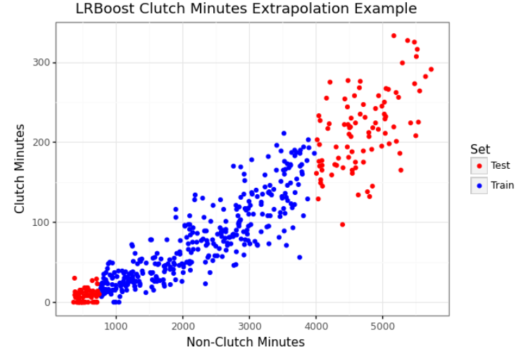

.. lrboost documentation master file, created by
   sphinx-quickstart on Mon Jan 4 14:44:12 2022.

Welcome to LRBoost's documentation!
============================================

lrboost is an scikit-learn compatible simple stacking protocol for prediction.

.. toctree::
   :maxdepth: 2
   :hidden:
   :caption: Getting Started

   quick_start

Getting Started
-------------------------------------

LRBoostRegressor works in three steps.

* Fit a linear model to a target ``y``
     *  This is the primary model accesible via ``LRBoost.primary_model`` 
* Fit a tree-based model to the residual (``y_pred - y``) of the linear model 
     *  This is the secondary model accesible via ``LRBoost.secondary_model`` 
* Combine the two predictions into a final prediction in the scale of the original target

LRBoostRegressor defaults to ``sklearn.linear_model.RidgeCV()`` and ``sklearn.ensemble.HistGradientBoostingRegressor()`` as the linear (primary) and non-linear (secondary) model respectively.

   >>> from sklearn.datasets import load_diabetes
   >>> from lrboost import LRBoostRegressor
   >>> X, y = load_iris(return_X_y=True)
   >>> lrb = LRBoostRegressor().fit(X, y)
   >>> predictions = lrb.predict(X)
   >>> detailed_predictions = lrb.predict(X, detail=True)
   >>> print(lrb.primary_model.score(X, y)) #R2
   >>> print(lrb.score(X, y)) #R2
   >>> 0.512
   >>> 0.933

The linear and non-linear models are both fit in the ``fit()`` method and used to then predict on any new data. Because lrboost is a very slightly modified scklearn class, you can hyperparameter tune the tree model as you would normally.

* ``predict(X)`` returns an array-like of final predictions with an option for ``predict(X, detail=True)`` 
* ``predict_dist(X)`` provides probabilistic predictions associated with ``NGBoost`` or ``XGBoost-Distribution`` as the non-linear estimators.

Any sklearn compatible estimator can be used with LRBoost, and you can unpack kwargs as needed.

    >>> from sklearn.datasets import load_iris
    >>> from sklearn.ensemble import RandomForestRegressor 
    >>> from lrboost import LRBoostRegressor
    >>> X, y = load_iris(return_X_y=True)
    >>> ridge_args = {"alphas": np.logspace(-4, 3, 10, endpoint=True),
                     "cv": 5}
    >>> rf_args = {"n_estimators": 50, 
                  "n_jobs": -1}
    >>> lrb = LRBoostRegressor(linear_model=RidgeCV(**ridge_args),
                        non_linear_model=RandomForestRegressor(**rf_args))
    >>> lrb = LRBoostRegressor.fit(X, y)
    >>> predictions = lrb.predict(X)

* LRBoost is not going to magically provide improved error in all circumstances.
* Situations with extrapolation outside of the training dataset might be particularly useful.

Hyperparamter Tuning
-------------------------------------

Model Comparison - Example 1
-------------------------------------

* This is a (simplified) example of predicting clutch minutes from non-clutch minutes in NBA basketball.
* It has a known linear and non-linear combination and extrapolation can be difficult.

* Using the above test/train split we can show an extrapolation task on the tails of the distribution.

   >>> import pandas as pd
   >>> import numpy as np
   >>> from sklearn.metrics import mean_squared_error
   >>> from sklearn.ensemble import HistGradientBoostingRegressor
   >>> clutch = pd.read_csv('../examples/clutch.csv')
   >>> train_mask = (clutch['nonclutch_min'] <= 4000) & (clutch['nonclutch_min'] >= 750)
   >>> train = clutch[train_mask]
   >>> test = clutch[~train_mask]
   >>> X_train = train[['nonclutch_min']]
   >>> y_train = train['clutch_min']
   >>> X_test = test[['nonclutch_min']]
   >>> y_test = test['clutch_min']
   >>> gbm = HistGradientBoostingRegressor(max_iter=500, random_state=42).fit(X_train, y_train)
   >>> lrb = LRBoostRegressor(secondary_model=HistGradientBoostingRegressor(max_iter=500, random_state=42)).fit(X_train, y_train)
   >>> print(f"Ridge RMSE: {round(mean_squared_error(lrb.primary_model.predict(X_test), y_test), 2)}")
   >>> print(f"HistGradientBoostingRegressor RMSE: {round(mean_squared_error(gbm.predict(X_test), y_test), 2)}")
   >>> print(f"LRBoost RMSE: {round(mean_squared_error(lrb.predict(X_test), y_test), 2)}")
   >>> Ridge RMSE: 1385.81
   >>> HistGradientBoostingRegressor RMSE: 3145.87
   >>> LRBoost RMSE: 1080.42

   If we also attempt a general train/test split, LRBoost performs well.

   >>> Ridge RMSE: 570.01
   >>> HistGradientBoostingRegressor RMSE: 743.66
   >>> LRBoost RMSE: 733.4
   

Model Comparison - Example 2
-------------------------------------

* The following are some simple examples taken from `Zhang et al. (2019) <https://arxiv.org/abs/1904.10416v1>`_

   >>> import pandas as pd
   >>> import numpy as np
   >>> from sklearn.metrics import mean_squared_error
   >>> from sklearn.ensemble import HistGradientBoostingRegressor
   >>> from sklearn.model_selection import train_test_split
   >>> concrete = pd.read_csv("../examples/concrete_data.csv")
   >>> features = ['cement', 'slag', 'fly_ash', 'water', 'superplastic', 'coarse_agg', 'fine_agg', 'age', 'cw_ratio']
   >>> target = 'ccs'
   >>> def evaluate_models(X_train, X_test, y_train, y_test):
      >>> lrb = LRBoostRegressor(primary_model=RidgeCV(alphas=np.logspace(-4, 3, 10, endpoint=True)))
      >>> lrb.fit(X_train, y_train.ravel())
      >>> detailed_predictions = lrb.predict(X_test, detail=True)
      >>> primary_predictions = detailed_predictions['primary_prediction']
      >>> rb_predictions = detailed_predictions['final_prediction']
      >>> hgb = HistGradientBoostingRegressor()
      >>> hgb.fit(X_train, y_train.ravel())
      >>> hgb_predictions = hgb.predict(X_test)
      >>> print(f"Ridge RMSE: {round(mean_squared_error(primary_predictions, y_test.ravel()), 2)}")
      >>> print(f"HistGradientBoostingRegressor RMSE: {round(mean_squared_error(hgb_predictions, y_test.ravel()), 2)}")
      >>> print(f"LRBoost RMSE: {round(mean_squared_error(lrb_predictions, y_test.ravel()), 2)}")
   
   >>> # Scenario 1: 75/25 train/test (Interpolation)
   >>> X_train, X_test, y_train, y_test = train_test_split(concrete[features], 
                                                           concrete[target], 
                                                           train_size=0.75, random_state=100)   
   >>> evaluate_models(X_train, X_test, y_train, y_test)
   >>> # Ridge RMSE: 112.4
   >>> # HistGradientBoostingRegressor RMSE: 26.33
   >>> # LRBoost RMSE: 25.06

   >>> # Scenario 2: 50/50 train/test (Interpolation)
   >>> X_train, X_test, y_train, y_test = train_test_split(concrete[features], 
                                                           concrete[target], 
                                                           train_size=0.50, random_state=100)
   >>> evaluate_models(X_train, X_test, y_train, y_test)
   >>> # Ridge RMSE: 107.6
   >>> # HistGradientBoostingRegressor RMSE: 26.6
   >>> # LRBoost RMSE: 23.55

   >>> # Scenario 3: Training: CCS > 25, Testing: CCS <= 25 (Extrapolation)
   >>> train = concrete.loc[concrete['ccs'] > 25]
   >>> test = concrete.loc[concrete['ccs'] <= 25]
   >>> X_train = train[features]
   >>> y_train = train[target]
   >>> X_test = train[features]
   >>> y_test = train[target]
   >>> evaluate_models(X_train, X_test, y_train, y_test)
   >>> # Ridge RMSE: 89.26
   >>> # HistGradientBoostingRegressor RMSE: 4.21
   >>> # LRBoost RMSE: 3.7

* With zero tuning of either the LRBoost internal GBDT fit to the residual or the "standard" GBDT, LRBoost performs well.
